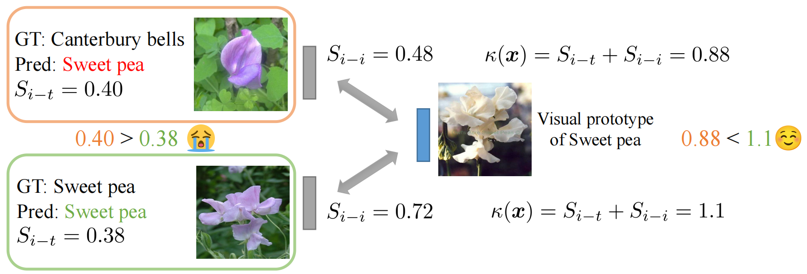

<div align="center">

<h1>To Trust Or Not To Trust Your Vision-Language Model's Prediction</h1>

<div>
    <a href='https://sites.google.com/view/dong-hao/' target='_blank'>Hao Dong</a><sup>1</sup>&emsp;
    <a href='https://www.linkedin.com/in/moru-liu-a124a5246' target='_blank'>Moru Liu</a><sup>2</sup>&emsp;
    <a href='https://liangjian.xyz/' target='_blank'>Jian Liang</a><sup>3,4</sup>&emsp;
    <a href='https://chatzi.ibk.ethz.ch/about-us/people/prof-dr-eleni-chatzi.html' target='_blank'>Eleni Chatzi</a><sup>1</sup>&emsp;
    <a href='https://people.epfl.ch/olga.fink?lang=en' target='_blank'>Olga Fink</a><sup>5</sup>
</div>
<div>
    <sup>1</sup>ETH Zurich, <sup>2</sup>Technical University of Munich, <sup>3</sup>NLPR & MAIS, IInstitute of Automation, Chinese Academy of Sciences, <sup>4</sup>University of Chinese Academy of Sciences, <sup>5</sup>EPFL
</div>


<div>
    <h4 align="center">
        • <a href="https://arxiv.org/abs/2505.23745" target='_blank'>arXiv 2025</a> •
    </h4>
</div>


<div style="text-align:center">

</div>

---

</div>

Illustration of TrustVLM's mechanism. Initially, the incorrect prediction receives a higher confidence score than the correct one, indicating overconfidence. By performing verification in the image embedding space, this overconfidence is mitigated. As a result, the final confidence score is significantly higher for the correct prediction than for the incorrect one.


## Prerequisites

### Environment 
The code was tested using `Python 3.10.13`, `torch 2.3.1+cu121` and `NVIDIA GeForce RTX 3090`. More dependencies are in `requirement.txt`.

### Datasets 

We suggest downloading all datasets to a root directory, and renaming the directory of each dataset as suggested in `${ID_to_DIRNAME}` in `./data/datautils.py`.  Please refer to [this page](https://github.com/KaiyangZhou/CoOp/blob/main/DATASETS.md#how-to-install-datasets) to download and prepare datasets accordingly.


## Run TrustVLM-D
```
bash ./test_trustvlm.sh
```


## Run TrustVLM*-D
```
bash ./test_trustvlm_v2.sh
```

## Citation
If you find our work useful in your research please consider citing our [paper](https://arxiv.org/abs/2505.23745):

```
@article{dong2025trustvlm,
    title={To Trust Or Not To Trust Your Vision-Language Model's Prediction},
    author={Dong, Hao and Liu, Moru and Liang, Jian and Chatzi, Eleni and Fink, Olga},
    journal={arXiv preprint arXiv:2505.23745},
    year={2025}
}
```

## Acknowledgements
We thank the authors of [TPT](https://github.com/KaiyangZhou/CoOp) and [CoOp](https://github.com/KaiyangZhou/CoOp) for their open-source implementation and instructions on data preparation. 
